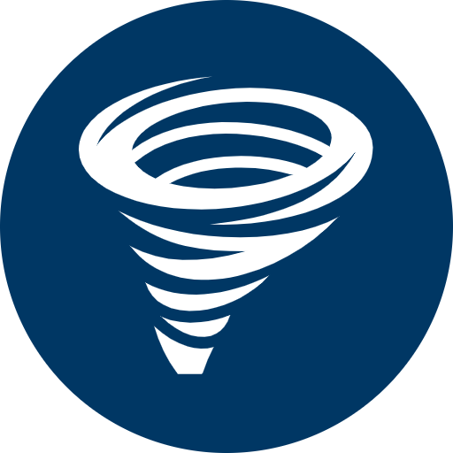

<a name="readme-top"></a>

<!-- PROJECT SHIELDS -->
<!--
*** I'm using markdown "reference style" links for readability.
*** Reference links are enclosed in brackets [ ] instead of parentheses ( ).
*** See the bottom of this document for the declaration of the reference variables
*** for contributors-url, forks-url, etc. This is an optional, concise syntax you may use.
*** https://www.markdownguide.org/basic-syntax/#reference-style-links
-->
[![Contributors][contributors-shield]][contributors-url]
[![Forks][forks-shield]][forks-url]
[![Stargazers][stars-shield]][stars-url]
[![Issues][issues-shield]][issues-url]
[![MIT License][license-shield]][license-url]


<!-- PROJECT LOGO -->
<br />
<div align="center">
  <a href="https://github.com/DMurf/Charybdis">
    
  </a>

<h3 align="center">Charybdis</h3>

  <p align="center">
    A WIP project
    <br />
    <br />
    <a href="#">View</a>
    ·
    <a href="https://github.com/DMurf/Charybdis/issues/new?labels=bug&template=bug-report---.md">Report Bug</a>
    ·
    <a href="https://github.com/DMurf/Charybdis/issues/new?labels=enhancement&template=feature-request---.md">Request Feature</a>
  </p>
</div>


<!-- TABLE OF CONTENTS -->
<details>
  <summary>Table of Contents</summary>
  <ol>
    <li>
      <a href="#about-the-project">About The Project</a>
      <ul>
        <li><a href="#built-with">Built With</a></li>
      </ul>
    </li>
    <li>
      <a href="#getting-started">Getting Started</a>
      <ul>
        <li><a href="#prerequisites">Prerequisites</a></li>
        <li><a href="#installation">Installation</a></li>
      </ul>
    </li>
    <li><a href="#usage">Usage</a></li>
    <li><a href="#roadmap">Roadmap</a></li>
    <li><a href="#contributing">Contributing</a></li>
    <li><a href="#license">License</a></li>
    <li><a href="#contact">Contact</a></li>
    <li><a href="#acknowledgments">Acknowledgments</a></li>
  </ol>
</details>


<!-- ABOUT THE PROJECT -->
## About The Project

TBC

| Environment | URL | Status | CodeCov
| --- | --- | --- | --- |
| Production | to be confirmed |  | [](https://codecov.io/gh/DMurf/Charybdis) |
| Test | to be confirmed  |  | N/A |


<p align="right">(<a href="#readme-top">back to top</a>)</p>


### Built With
<a href="https://docs.microsoft.com/en-us/dotnet/csharp/"></a>

<a href="https://github.com/DMurf/Charybdis"></a>


<a href="https://dotnet.microsoft.com/download"></a>


<p align="right">(<a href="#readme-top">back to top</a>)</p>


<!-- GETTING STARTED -->
## Getting Started

This is an AspNet MVC application, using npm for content. 


### Installation

This guide takes the following assumptions:

* You already have npm and visual studio installed


1. Clone 
``` git
https://github.com/DMurf/Charybdis.git
```

2. Navigate to root

3. Update appsettings.json with settings.

4. Run Tests + npm install

5. Enjoy!


<p align="right">(<a href="#readme-top">back to top</a>)</p>

## Appsettings

Insert appropriate app settings here...

``` json
"AzureAdB2C": {
    "secretValue": "",
    "secretId": "",
    "Instance": "",
    "ClientId": "",
    "Domain": "",
    "SignedOutCallbackPath": "/profile/gone",
    "CallbackPath": "/signin-oidc",
    "SignUpSignInPolicyId": "B2C_1_signupsignin",
    "EditProfilePolicyId": "B2C_1_profileediting"
  }
```

<!-- USAGE EXAMPLES -->
## Usage

### Getting started!

To do...

<p align="right">(<a href="#readme-top">back to top</a>)</p>

<!-- CONTRIBUTING -->
## Contributing

Contributions are what make the open source community such an amazing place to learn, inspire, and create. Any contributions you make are **greatly appreciated**.

If you have a suggestion that would make this better, please fork the repo and create a pull request. You can also simply open an issue with the tag "enhancement".
Don't forget to give the project a star! Thanks again!

1. Fork the Project
2. Create your Feature Branch (`git checkout -b feature/AmazingFeature`)
3. Commit your Changes (`git commit -m 'Add some AmazingFeature'`)
4. Push to the Branch (`git push origin feature/AmazingFeature`)
5. Open a Pull Request

<p align="right">(<a href="#readme-top">back to top</a>)</p>


<!-- LICENSE -->
## License

Distributed under the MIT License. See `LICENSE.txt` for more information.

<p align="right">(<a href="#readme-top">back to top</a>)</p>


<!-- CONTACT -->
## Contact

Project Link: [https://github.com/DMurf/Charybdis](https://github.com/DMurf/Charybdis)

<p align="right">(<a href="#readme-top">back to top</a>)</p>


<!-- MARKDOWN LINKS & IMAGES -->
<!-- https://www.markdownguide.org/basic-syntax/#reference-style-links -->
[contributors-shield]: https://img.shields.io/github/contributors/DMurf/Charybdis.svg?style=for-the-badge
[contributors-url]: https://github.com/DMurf/Charybdis/graphs/contributors
[forks-shield]: https://img.shields.io/github/forks/DMurf/Charybdis.svg?style=for-the-badge
[forks-url]: https://github.com/DMurf/Charybdis/network/members
[stars-shield]: https://img.shields.io/github/stars/DMurf/Charybdis.svg?style=for-the-badge
[stars-url]: https://github.com/DMurf/Charybdis/stargazers
[issues-shield]: https://img.shields.io/github/issues/DMurf/Charybdis.svg?style=for-the-badge
[issues-url]: https://github.com/DMurf/Charybdis/issues
[license-shield]: https://img.shields.io/github/license/DMurf/Charybdis.svg?style=for-the-badge
[license-url]: https://github.com/DMurf/Charybdis/blob/master/LICENSE.txt

[language-shield]: https://img.shields.io/badge/dynamic/xml?label=target&query=%2F%2FTargetFramework%5B1%5D&url=https://raw.githubusercontent.com/DMurf/Charybdis/main/Charybdis.Web/Charybdis.Web.csproj&logo=.net?style=for-the-badge

[language-url]: https://learn.microsoft.com/en-us/dotnet/csharp/